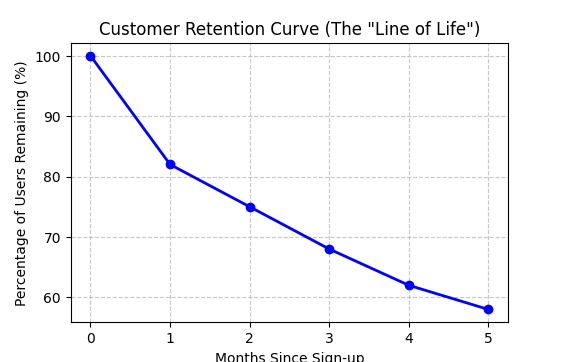

 <h1 align="center"><b>User Retention & CLV Analysis</b></h1>

## Project Overview

This project analyzes 55,000+ transactions across 1,000+ users to understand user retention, identify behavioral patterns, and estimate long-term customer value.

Using MySQL for data analysis and Python for predictive modeling, the project focuses on uncovering retention drivers, churn risks, and growth opportunities relevant to consumer and fintech products.
#

## Key Insights & Business Impact

•	Strong Early Retention: Identified 82% Month-1 retention, indicating effective initial user engagement 

•	Retention Driver Identified: Users with 7+ transactions in the first week showed significantly higher long-term retention 

•	Customer Lifetime Value (CLV): Built a predictive model estimating $550+ 12-month CLV per user, supporting data-driven acquisition strategy 

•	Churn Detection: Developed SQL-based logic to flag users with >50% drop in activity, enabling targeted retention and re-engagement strategies
#

## Visualizations

1. Customer Retention Curve

  Illustrates how user retention evolves over time and stabilizes across cohorts

  
 
  
  

2. 12-Month CLV Forecast

Predicts long-term revenue contribution per user using a regression model

 
 
 
 

 #

 ## Tech Stack
 
•	SQL (MySQL): CTEs, Window Functions, Joins, Data Validation 

•	Python: Pandas, Scikit-learn, Matplotlib 

•	Analytics Techniques: Cohort Analysis | Retention Analysis | Predictive Modelling | Segmentation
#

## Key Takeaway

Early user engagement is a critical driver of long-term retention and revenue. By identifying behavioral patterns in the first week, businesses can design targeted interventions to improve retention, reduce churn, and maximize customer lifetime value.
